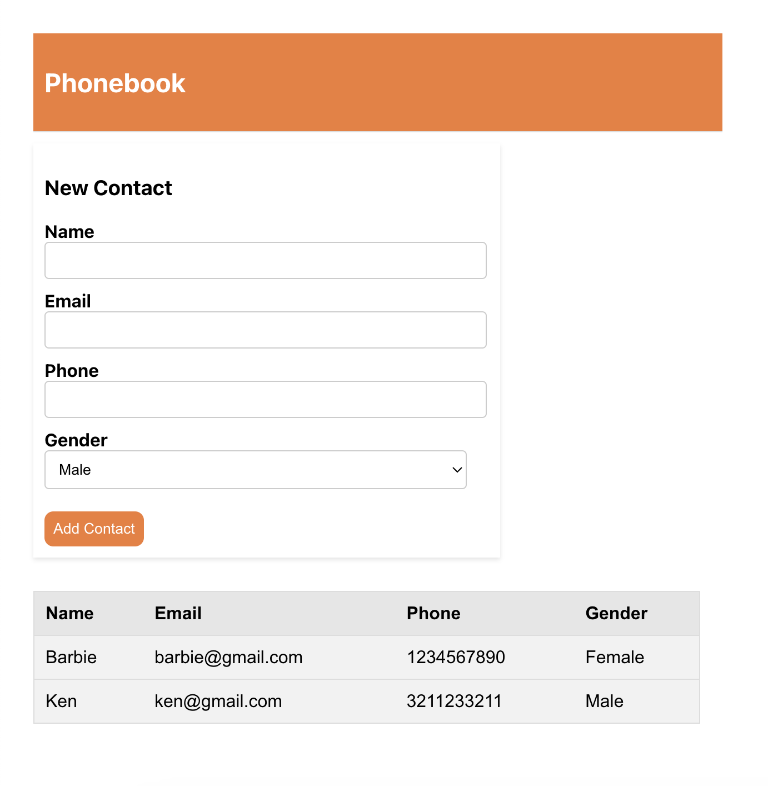

# Phonebook-WebApp

## Summary
An app that displays a phonebook table—sorted by name—and allows for adding new contacts via a form.

## Usage Instructions
1. Change into the app directory: `cd phonebook-app`
2. Run `npm install`
3. Run `npm start`
4. Visit http://localhost:3000/ in your browser

## Example
 

## Requirements:
1. [x] Pull user data from this [API](https://jsonplaceholder.typicode.com/users)
2. [x] Display it in a table
3. [x] Sort the table by one of the columns
4. [x] Replace the API call with a custom form for user data
5. [ ] Add form validation (e.g. email should contain an '@')
6. [ ] Add a navbar